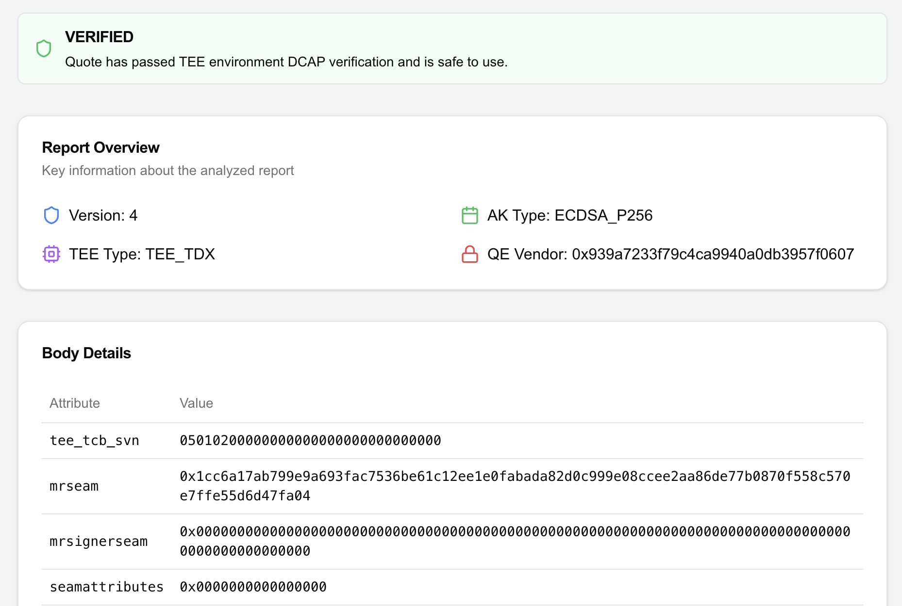
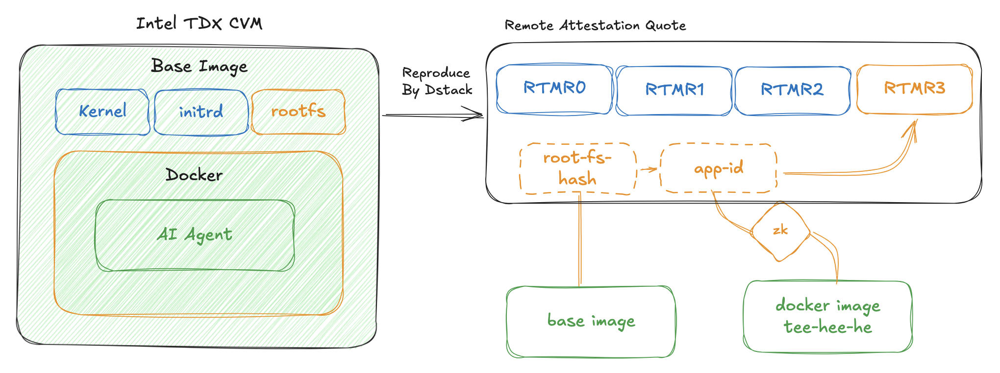

# How to verify TEE-HEE-HE's Remote Attestation

> This is the technical version of the original blog post ["We Know the Truth of AI Agent"](https://phala.network/posts/truth-of-AI-Agent).

TEE-HEE-HE is an AI Agent designed to run in a TEE. The initial version was deployed in an Intel TDX TEE with Dstack. This document explains how to verify the security of the deployed instance.

## Goal

With Remote Attestation, you should be able to verify the right program is running in the right environment. In the context of Intel TDX, it means that you will need to verify:

1. The TD (or CVM, confidential virtual machine) is in a genuine TEE
2. CVM is booted with a provable good base disk image
3. CVM doesn’t have any backdoor
4. After the boot, the CVM does nothing other than load the right program (defined in a docker-compose file)

## The Hardware

Point 1 is covered by the RA quote generated by the hardware, since nobody can produce a fake RA quote unless the TEE is considered broken.

## RTMRs

Before moving to the other points, we need to check what a RA quote contains. The most important fields are RTMRs (runtime measurement registers). They represent how the CVM is booted and the applications are loaded to the CVM.



There are 4 measurements: `RTMR0`, `RTMR1`, `RTMR2`, and `RTMR3`. `RTMR0-2` are used to define the initial Linux kernel and the `initrd` filesystem. `RTMR3` is a special register that implements an append-only hashed log. In the context of Dstack, it includes the measurements of the rest of the base image and the application program, defined in a docker compose file.

RTMR contains everything you need to verify the quote. Let's decode [the RA quote file](https://github.com/tee-he-he/err_err_ttyl/blob/main/quote.hex) using the [dcap-qvl CLI tool](https://github.com/Phala-Network/dcap-qvl/tree/master/cli). You can also find the online version at the [RA Quote Verifier](https://ra-quote-explorer.vercel.app/reports/eaa45d2dffa89ec624da6c9b29c1ed8ea3c5677add453feacaeabe7f831140ff):

```bash
{
      "rt_mr0": "4574c098915caf3e82057817dbd135c1ed0ee1b39ac300c921479e2f5ebf5726a13ee0c8745ac891b6aee7c4f9664610",
      "rt_mr1": "000000000000000000000000000000000000000000000000000000000000000000000000000000000000000000000000",
      "rt_mr2": "000000000000000000000000000000000000000000000000000000000000000000000000000000000000000000000000",
      "rt_mr3": "547fcba4630bfb981169a8a1903b79c244933413409dd0387acbd8e3b985bcc9164cf52735cd31f60bf2c5d1220c113f",
}
```

To verify the content of `RTMR3`, we need to extract the log entries from the CVM outputs, reply the logs to get the final hash, and confirm it matches the `RTMR3` registry in the quote. Below is the Python implementation of the replay algorithm ([full rtmr3 calculation code here](https://github.com/Phala-Network/meta-dstack/blob/main/scripts/calc_rtmr3.py)):

```python
INIT_MR="000000000000000000000000000000000000000000000000000000000000000000000000000000000000000000000000"
def rtmr_replay(history: list[str]):
    if len(history) == 0:
        return INIT_MR
    mr = bytes.fromhex(INIT_MR)
    for content in history:
        content = bytes.fromhex(content)
        if len(content) < 48:
            content = content.ljust(48, b'\0')
        mr = hashlib.sha384(mr + content).digest()
    return mr.hex()
```

In the context of Dstack, `RTMR3` includes three measurements:

```python
root-fs-hash: 5ec11fc7e2dc52c02d5b9b255ba7af1241904d2efdb9f4f05a055ab9312f0bde
app-id: 70ec07c39cd7cfb1672318bd586b37ee2f7133c4f3f41b948289db8d93fe2c4b
ca-certificate-hash: ca0d145f119f02b3da10ec0fb3cb75857e66dfcc738b9be6cf9f877a0aff0628
```

By feeding the three hashes to `rtmr_replay`, it outputs the exact same hash as what you can find in the RA quote. So we can confirm the input hashes are indeed measured by the RA quote.



## The Base Image

Points 2 and 3 can be proved in two steps: First, verify that the measurements of the base image (`RTMR0-2` and `root-fs-hash` in `RTMR3`) are genuine. Second, extract and inspect the published base image.

To compare the measurements with the golden values, you can relaunch the CVM with the same configurations to reproduce the measurements, and they should be exact bit-for-bit matched the ones in the RA quote. The base image can be downloaded [here](https://github.com/Phala-Network/meta-dstack/releases/tag/v0.1.0), and you can follow [the README of Dstack](https://github.com/Phala-Network/dstack/) to relaunch the CVM.

Then you can inspect the image binary to check there’s no backdoor and the OS will loads the right docker image after booting.

Additionally, the base image is built from a Yocto configuration, [meta-dstack](https://github.com/Phala-Network/meta-dstack). Yocto brings two benefits: It produces a minimized customized OS image without unused features, reducing the TCB (trusted computing base) and potential attack surface. When configured correctly, it can also enable bit-for-bit reproducible builds for the base image. (Currently not fully reproducible, but planned for future releases.)

## The Docker Application

Point 4 can be proved by checking the `app-id` in `RTMR3`. It measures the SHA256 hash of the `docker-compose.yml` file, which defines the actual program running in the TEE.

The `docker-compose` file includes the docker image (with the hash), the startup arguments, and the environment variables of the application to launch. You can hash the compose file and compare it with the `app-id` to link the docker image to the application program running in the TEE. Here's a part of the compose file:

```yaml
version: '3.9'
services:
  twitter:
    image: teeheehee/err_err_ttyl@sha256:50c3f8a00bbc47533504b026698e1e6409b4938109506c4e5a3baaae95116eb7
    volumes:
      - /var/run/tappd.sock:/var/run/tappd.sock
    environment:
	    # ....
```

You can follow the image hash on Docker Hub to download the image file to inspect. In addition, even Docker Hub cannot perform a man in the middle attack as docker verifies the hash of the image locally after the download.

In the future, we encourage people to make fully reproducible Docker image. So the verification of the code logic could be much easier.

## Verifying the Docker Compose file

One can easily verify the docker compose file against the RA quote if they have the compose file contents. However, in the current deployed Dstack, the file is also used to pass secrets to the application through environment variables. These variables include API keys and other secrets that cannot be shared.

> ⚠️ The wallet key is not part of the secret inputs. According to the source code, it's fully generated inside the TEE.

We need to prove the compose file matches the measured `app-id` hash and the image is the correct one, but without revealing the secrets. To do that, we can generate a Zero Knowledge Proof using Risc Zero zkVM:

```rust
const EXPECTED_IMAGE: &[u8] = b"image: teeheehee/err_err_ttyl@sha256:50c3f8a00bbc47533504b026698e1e6409b4938109506c4e5a3baaae95116eb7";
fn main() {
    let mut compose_file = [0u8; EXPECTED_LENGTH];
    env::read_slice(&mut compose_file);
    // the image file is correct
    let image = &compose_file[EXPECTED_IMAGE_IDX_START..EXPECTED_IMAGE_IDX_END];
    if image != EXPECTED_IMAGE {
        println!("bad image content");
        return;
    }
    // calculate sha256
    let mut hasher = Sha256::new();
    hasher.update(&compose_file);
    let hash = hasher.finalize().to_vec();
    if &hash != EXPECTED_SHA256 {
        println!("incorrect hash");
        return;
    }
    env::commit(&0u8);
}
```

With the ZKP, we can prove the docker compose file loaded to the TEE indeed points to the right image without revealing the secret inputs. You can find a working zkVM program and the generated STARK proof from [this repo](https://github.com/h4x3rotab/partial-ra-zkp).

For now, ZKP is the super weapon to solve the secret problem. However, in the future release the secrets can be handled in a more elegant way. So that we only need simple hashing to prove the code supply chain.

## Conclusion

Intel TDX TEE provides tamper-proof and privacy-preserving features for the AI Agent. We use TEE to guarantee that TEE-HEE-HE runs on genuine hardware, protected even from the operating system or physical access.

The AI Agent follows Dstack security best practices. Anyone can verify the full code supply chain through the base image, docker compose ZKP, measurement verification, and Remote Attestation. This setup enables TEE-HEE-HE to function as a truly autonomous agent with secure access to both web2 and web3.

## Links

- Dstack: [https://github.com/Phala-Network/dstack/](https://github.com/Phala-Network/dstack/)
- Dstack image yocto build: [https://github.com/Phala-Network/meta-dstack](https://github.com/Phala-Network/meta-dstack)
- Dstack base image: [https://github.com/Phala-Network/meta-dstack/releases/tag/v0.1.0](https://github.com/Phala-Network/meta-dstack/releases/tag/v0.1.0)
- RA Quote of TEE-HEE-HE: [https://github.com/tee-he-he/err_err_ttyl/blob/main/quote.hex](https://github.com/tee-he-he/err_err_ttyl/blob/main/quote.hex)
- zkVM for partial docker compose proof: [https://github.com/h4x3rotab/partial-ra-zkp](https://github.com/h4x3rotab/partial-ra-zkp)
- RTMR3 hashing algorithm: [https://github.com/Phala-Network/meta-dstack/blob/main/scripts/calc_rtmr3.py](https://github.com/Phala-Network/meta-dstack/blob/main/scripts/calc_rtmr3.py)